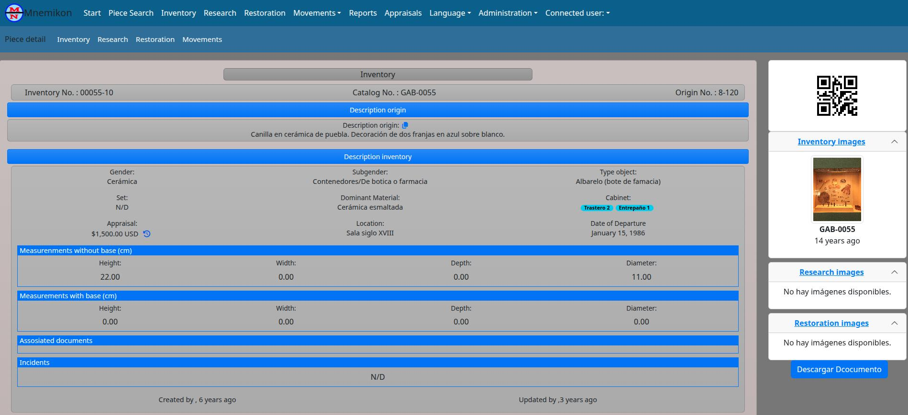

# Mnemikon Backend

> 🚧 **Active Development**

Backend service for **Mnemikon**, an **Open Source Museum Collection Management System** built with Django, Django REST Framework and MongoDB.

The backend provides the REST API, authentication, business logic and data management powering the Mnemikon ecosystem.

The project is designed as a modern, extensible and self-hosted solution for museums, cultural institutions and organizations that need to manage museum collections, research, restoration processes and collection movements.

---

## Overview

Mnemikon is an Open Source Museum Collection Management System designed to support museums and cultural institutions in managing collections throughout their entire lifecycle.

The platform centralizes inventory, research, restoration, loans, digital documentation and document version history within a single application, providing a flexible and extensible solution built on modern web technologies.

The backend exposes a REST API that powers the frontend application while handling authentication, business rules, document management and data persistence.

---

## Key Features

- REST API built with Django REST Framework.
- JWT authentication.
- MongoDB document-based storage.
- Museum inventory management.
- Research management.
- Restoration management.
- Collection movement and loan tracking.
- Role-based access control.
- Complete document version history.
- File and image management.
- PDF report generation.
- Designed for self-hosted deployments.

---

## Application Preview



*Inventory module displaying museum object metadata, images, documents and collection management tools.*

---

## Technology Stack

### Backend

- Python
- Django
- Django REST Framework

### Database

- MongoDB

### Authentication

- JSON Web Token (JWT)
- Django Simple JWT

### Infrastructure

- Docker (optional)
- Apache HTTP Server
- Linux (optional but recomended)

### Frontend

The web interface is developed as a separate project using **React**.

👉 **Frontend Repository:** ReactMnemikon

---

## Architecture

Mnemikon Backend follows a modular architecture based on Django applications, where each business domain is implemented as an independent module.

The backend exposes a REST API consumed by the React frontend while centralizing business logic, authentication, authorization and data persistence.

Museum information is stored using MongoDB documents, providing a flexible data model suitable for complex museum records and historical document versioning.

The application was designed to support long-term maintainability by separating responsibilities between the frontend, backend and infrastructure layers, allowing each component to evolve independently.

The backend is intended to run as a self-hosted service and can be deployed using Docker on Linux servers, with Apache HTTP Server acting as a Reverse Proxy.

---

# Installation

## Requirements

Before installing Mnemikon Backend, ensure your system meets the following requirements:

- Python 3.12 or newer
- MongoDB
- Git
- GCC
- Pandoc
- XeLaTeX (LaTeX distribution)

---

## Native Installation

### 1. Clone the repository

```bash
git clone https://github.com/and-pad/Mnemosine3BackEnd.git
cd Mnemosine3BackEnd
```

### 2. Install system dependencies (Debian / Ubuntu)

```bash
sudo apt update

sudo apt install -y \
    pandoc \
    texlive-latex-base \
    texlive-xetex \
    texlive-fonts-recommended \
    texlive-latex-recommended \
    texlive-latex-extra \
    lmodern \
    gcc
```

### 3. Create a virtual environment

Linux

```bash
python3 -m venv venv
source venv/bin/activate
```

Windows

```cmd
python -m venv venv
venv\Scripts\activate
```

### 4. Install Python dependencies

```bash
pip install -r requirements.txt
```

### 5. Configure the application

Review the configuration values in `settings.py` before running the application.

A reference configuration is available in `settings.example.py`.

---

## Docker Installation

Docker automatically installs all required system dependencies during the image build.

```bash
git clone https://github.com/and-pad/Mnemosine3BackEnd.git
cd Mnemosine3BackEnd

docker compose up --build
```

---

The backend will be available after the containers finish starting.

Continue with the **Configuration** section to configure MongoDB, environment variables and authentication.


# Configuration

Mnemikon is configured through the `settings.py` file.

Before running the application, review the following settings according to your environment.

## General

- `SECRET_KEY`
- `DEBUG`
- `ALLOWED_HOSTS`

## MongoDB

Configure the MongoDB connection:

- `MONGO_DB_NAME`
- `MONGO_USER_NAME`
- `MONGO_PASSWORD`
- `MONGO_IP`
- `MONGO_PORT`

## Authentication

The backend uses:

- Django custom user model
- Custom MongoDB authentication backend
- JWT authentication

## CORS

During development configure:

- `CORS_ALLOWED_ORIGINS`

For production, configure only the frontend domain.

## File Storage

Mnemikon stores uploaded images and documents on the local filesystem.

Before running the application, review and update the storage paths in `settings.py` according to your deployment.

### Temporary uploads

- `TEMPORARY_UPLOAD_DIRECTORY`

### Inventory

Images

- `PHOTO_INVENTORY_PATH`
- `THUMBNAILS_INVENTORY_PATH`

Documents

- `DOCUMENT_INVENTORY_PATH`

### Research

Images

- `PHOTO_RESEARCH_PATH`
- `THUMBNAILS_RESEARCH_PATH`

Documents

- `DOCUMENT_RESEARCH_PATH`

### Restoration

Images

- `PHOTO_RESTORATION_PATH`
- `THUMBNAILS_RESTORATION_PATH`

Documents

- `DOCUMENT_RESTORATION_PATH`

> **Note**
>
> Mnemikon stores original images and generated thumbnails in separate directories. Documents, Photos and Thumbnail directories must exist and be writable by the application.

# Running the Project (Development)

Apply migrations (if required):

```bash
python manage.py migrate
```

Start the development server:

```bash
python manage.py runserver
```

The API will be available at:

```
http://127.0.0.1:8000/
```